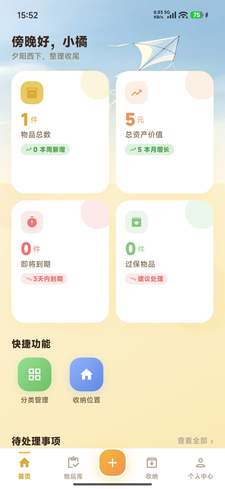
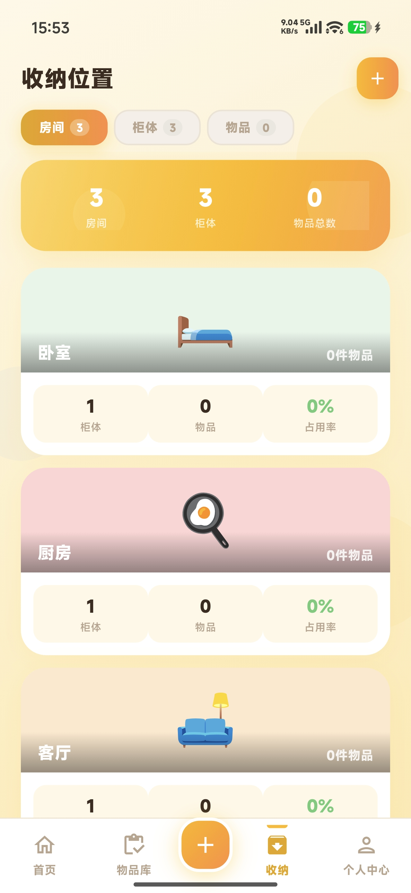
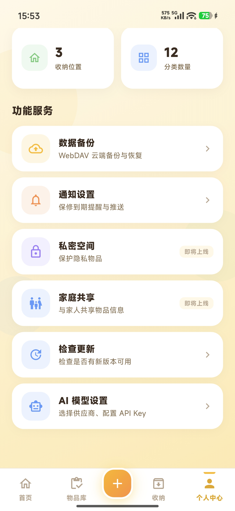
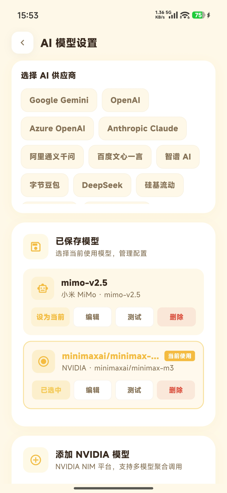

<div align="center">
  
  <h1>家藏 (JiaCang) — 家居物品收纳管理 App</h1>
  <p><strong>从此不再忘记东西放在哪里。</strong></p>
  <p>记录位置 · 分类管理 · 到期追踪 · AI 识别 · 多端运行</p>
  <p>
    
    
    
  </p>
</div>

---

## 📖 家藏是什么

你是否有过这样的经历：明明记得家里有个东西，却翻箱倒柜找不到？买了一堆同类物品，却不记得已经有哪些了？

**家藏帮你解决这些烦恼。**

它是一款基于 Flutter 的家居物品收纳管理 App，帮你记录每件物品的存放位置、分类信息和到期时间。支持 AI 拍照识别、电商订单批量导入和 WebDAV 云备份，一套代码运行在 Android / iOS / Windows / macOS / Linux / Web 六端。

---

## 📱 截图

<table>
  <tr>
    <td align="center"><sub>首页概览，一目了然</sub></td>
    <td align="center"><sub>分类管理，井井有条</sub></td>
    <td align="center"><sub>房间→柜体→格子，精准定位</sub></td>
    <td align="center"><sub>到期倒计时，心中有数</sub></td>
    <td align="center"><sub>拍照识别，自动录入</sub></td>
  </tr>
</table>

---

## ✨ 功能

- **🤖 AI 拍照识别**：拍张照片（或从相册选择），AI 自动填充名称、品牌、分类。内置 18 家 AI 服务商（DeepSeek / 豆包 / 通义千问 / Gemini / Claude / 智谱 / 月之暗面等），并支持任意 OpenAI 兼容接口的自定义接入。
- **📦 物品管理**：记录名称、分类、存放位置、状态（在库 / 借出 / 丢失 / 已用）、到期日、照片（最多 10 张，支持拍照与相册）、备注；登记时间自动记录。
- **🏠 空间层级**：房间 → 柜体 / 箱子 → 格子，层层定位；物品也可以直接放在房间内，不必强绑柜体。
- **⏰ 到期追踪**：为食品、药品等有保质期的物品设置到期日，首页「提醒」自动汇总已逾期 / 即将到期 / 长期闲置的物品。
- **📂 分类管理**：14 个内置分类（数码电子、家电、衣物鞋包、个人洗护、餐厨用品、家居生活、运动户外、书籍、文具办公、玩具兴趣、工具五金、饰品贵重、家居装饰、其他），支持自定义扩展与图标选择。
- **🔍 搜索筛选**：按名称 / 分类名搜索，按分类筛选，按登记时间排序，多行分类标签一屏可见。
- **📥 订单导入**：覆盖淘宝 / 京东 / 拼多多 / 抖音商城 / 苏宁 / 唯品会 / 考拉 7 大平台的导入引导，按步骤操作后批量生成物品记录。
- **📊 数据概览**：首页展示物品总数、即将到期、出借中、长期闲置四项；「我的」页汇总物品 / 分类 / 房间 / 收纳区数量。
- **☁️ WebDAV 备份**：连接任意 WebDAV 服务（坚果云、Nextcloud 等），备份和恢复数据库。
- **🔄 更新检查**：从 GitHub Releases 拉取最新版本信息，App 内提示更新。
- **🔒 密钥加密存储**：AI 服务商的 API Key / Secret 等敏感配置，以 PBKDF2（60 万次迭代）+ AES-256-GCM 加密后落库，不以明文保存。
- **🌐 Web 版**：一套代码编译为 Web 应用，数据存于浏览器 IndexedDB（drift + SQLite WASM + Web Worker），照片以 data URL 内联存储，支持页面内一键重置本地数据库。
- **📱 多平台**：Android / iOS / Windows / macOS / Linux / Web 六端。

---

## 🧠 设计理念

家藏的设计围绕一个核心问题：**如何用最少的操作，管理最多的物品。**

常见的管理方式要么依赖大脑记忆，要么需要在笔记里手动维护表格。前者容易遗忘，后者维护成本高、难以坚持。

家藏的方案是：

- **空间即结构**：物品的存放位置天然具有层级关系，家藏用「房间 → 柜体 / 箱子 → 格子」三级空间直接对应现实场景，录入时选位置就像把东西放进柜子里一样自然；零碎小物也可以直接挂在房间上，不强求层层归位。
- **AI 降低录入门槛**：拍照识别和订单导入让新建物品记录几乎零成本，解决了「懒得记」的问题。
- **自动化带来安心**：到期日自动计算与提醒、数据可加密、可云备份 —— 你只管用，剩下交给 App。

---

## 🆚 和其他方案的差异

| 功能 | 家藏 | 笔记类 (Notion/飞书) | 通用清单 App | Excel 手动管理 |
|---|---|---|---|---|
| **空间层级管理** | ✅ 三级 + 房间直存 | ❌ 需手动搭建 | ❌ | ⚠️ 需手动搭建 |
| **AI 拍照识别** | ✅ 18 家服务商 + 自定义 | ❌ | ❌ | ❌ |
| **电商订单导入** | ✅ 7 平台引导 | ❌ | ❌ | ❌ |
| **到期日追踪** | ✅ | ⚠️ 需公式 | ⚠️ 部分支持 | ⚠️ 需公式 |
| **WebDAV 云备份** | ✅ | ✅ | ⚠️ 部分支持 | ❌ |
| **密钥加密存储** | ✅ PBKDF2+AES-256-GCM | ⚠️ 部分支持 | ⚠️ 部分支持 | ❌ |
| **多平台** | ✅ 6 端 | ✅ | ⚠️ 部分支持 | ✅ |
| **开源** | ✅ MIT | ❌ | ❌ | ✅ |
| **学习成本** | 低 — 打开即用 | 中 — 需搭建模板 | 低 | 中 — 需公式 |

---

## 🗺️ Roadmap

### ✅ 已完成
- [x] 物品 CRUD（名称、分类、位置、状态、到期日、照片、备注）
- [x] 三级空间管理（房间 → 柜体/箱子 → 格子）+ 房间内直存
- [x] 14 内置分类 + 自定义分类与图标
- [x] 到期日追踪 + 首页待办提醒
- [x] AI 拍照识别（18 家服务商 + 自定义 OpenAI 兼容接口）
- [x] 电商订单批量导入（7 平台引导）
- [x] WebDAV 云备份 / 恢复
- [x] 敏感配置加密存储（PBKDF2 + AES-256-GCM）
- [x] Web 版（IndexedDB + SQLite WASM，照片内联存储）
- [x] 多平台：Android / iOS / Windows / macOS / Linux / Web

### 🚧 进行中
- [ ] 真实电商订单数据对接（当前为平台引导 + 演示数据）
- [ ] 物品标签系统
- [ ] 批量编辑物品
- [ ] 导出数据（CSV / JSON）

### 🔭 计划中
- [ ] 物品价值统计报表
- [ ] 搬家模式（批量导出 / 导入空间结构）
- [ ] 物品模板市场
- [ ] 家庭共享空间

---

## 🧑‍💻 给开发者

### 🚀 快速开始

```bash
git clone https://github.com/Crislii1989/jia-cang.git
cd jia-cang
cp .env.example .env        # 配置 Bugsnag 上报 Key（可留空占位，但文件必须存在）
flutter pub get
dart run build_runner build
flutter run
```

> `.env` 会被打包进应用资源，缺少它应用会启动失败（白屏），仓库内已提供 `.env.example` 模板。

#### 命名约定

- **Dart 包名**：`jia_cang`（import 路径为 `package:jia_cang/...`）。
- **本地数据库存储名**：`jiacang`。数据库即以此名保存，Web 端落在浏览器的 OPFS / IndexedDB 里。
- **WebDAV 备份**：备份上传到 `/jiacang_backups`（文件名前缀 `jiacang_backup_`）。

### 代码生成

修改 `models/`、`database/tables/` 或 `providers/`（riverpod 注解）后重新运行：

```bash
dart run build_runner build

# 开发时使用 watch 模式
dart run build_runner watch
```

### 测试

```bash
flutter test                                  # 全部测试
flutter test test/services/                   # 仅服务层测试
flutter test test/pages/                      # 仅页面级测试
```

### 构建发布

#### Android

```bash
flutter build apk --split-per-abi             # 按 ABI 拆分 APK
flutter build appbundle                       # AAB（Play Store）
```

签名配置在 `android/key.properties`（不提交），由 `android/app/build.gradle.kts` 读取。

#### Windows / macOS / Linux

```bash
flutter build windows
flutter build macos
flutter build linux
```

#### Web

```bash
flutter build web --release --pwa-strategy=none
```

Web 端依赖仓库内的 `web/sqlite3.wasm` 与 `web/drift_worker.js`（已随仓库提供），本地预览需用静态服务器承载（不要用 `flutter run` 的开发服务器校验生产行为）。

---

## 🛠️ 技术栈

| 类别 | 技术 | 用途 |
|---|---|---|
| UI 框架 | Flutter + Material 3 | 六端跨平台 UI |
| 状态管理 | Riverpod + riverpod_annotation (codegen) | 单向数据流 |
| 路由 | go_router (StatefulShellRoute) | 底部导航路由 |
| 本地存储 | drift (SQLite ORM) | 数据库（schema v9，7 张表） |
| Web 存储 | drift_flutter + SQLite WASM + Web Worker | 浏览器端 IndexedDB 持久化 |
| 网络请求 | dio | HTTP 请求 |
| 云备份 | webdav_client + archive | WebDAV 备份 / 恢复（压缩包） |
| 数据模型 | freezed + json_serializable | 不可变数据模型 |
| 加密 | crypto + cryptography (PBKDF2 + AES-256-GCM) | AI Key 等敏感配置加密 |
| 图片 | image_picker + photo_view | 拍照 / 相册 / 图片浏览 |
| 配置 | flutter_dotenv | `.env` 应用配置 |
| 崩溃收集 | bugsnag_flutter | 线上异常上报 |
| 安全存储 | flutter_secure_storage | 敏感信息（AI Key 等） |
| 版本信息 | package_info_plus | App 版本、构建号 |
| 链接跳转 | url_launcher | 外部链接 |
| HTML 解析 | html | 订单页内容解析 |

---

## 📁 项目结构

```
家藏/
├── lib/                              # 应用源码
│   ├── main.dart                     # 应用入口（加载 .env、初始化 Bugsnag、数据库就绪门控）
│   ├── app_router.dart               # 路由配置（底部导航 + 详情/编辑/设置子路由）
│   ├── constants/                    # 设计令牌：配色、字号、阴影、尺寸、皮肤、比例缩放
│   ├── database/                     # drift 数据库定义
│   │   ├── database.dart             # 数据库实例、迁移策略（当前 schema v9）
│   │   ├── seed_data.dart            # 首次安装种子数据（14 内置分类 / 默认房间 / 设置）
│   │   └── tables/                   # 7 张表：items / rooms / cabinets / slots /
│   │                                 #        categories / import_history / settings
│   ├── daos/                         # 数据访问层（每张表一个 DAO）
│   ├── models/                       # freezed 数据模型；enums/ 放 SortType、TabType 等枚举
│   ├── providers/                    # Riverpod 状态管理（codegen）
│   ├── services/                     # 业务服务
│   │   ├── ai/                       # AI 识别（接口 + 服务商注册表 + 18 家实现）
│   │   ├── encryption_service.dart   # PBKDF2 + AES-256-GCM 加解密
│   │   ├── first_run_service.dart    # 首次启动引导标记
│   │   ├── http_service.dart         # dio 封装
│   │   ├── photo_service.dart        # 相机/相册选图、校验、落盘/内联（含平台异常兜底）
│   │   ├── prompt_service.dart       # AI 提示词加载
│   │   ├── skin_store.dart           # 皮肤 / 外观持久化
│   │   ├── update_service.dart       # GitHub Releases 版本检查
│   │   └── webdav_service.dart       # WebDAV 备份 / 恢复
│   ├── screen/                       # 页面
│   │   ├── splash_page.dart          # 启动页
│   │   ├── home/                     # 首页（统计高卡 / 分类大圆 / 提醒卡组）
│   │   ├── inventory/                # 物品清单（分类标签、筛选面板、排序、批量操作）
│   │   ├── storage/                  # 空间管理（房间 / 柜体 / 箱子）
│   │   ├── category/                 # 分类管理（卡片式，支持自定义分类）
│   │   ├── me/                       # 个人中心（资料、统计、备份、AI 设置、外观、更新检查）
│   │   ├── scan/                     # AI 拍照识别
│   │   ├── order_import/             # 电商订单导入（7 平台引导）
│   │   ├── add_item_page.dart        # 新增 / 编辑物品
│   │   └── item_detail_page.dart     # 物品详情（照片轮播、到期倒计时）
│   ├── utils/                        # 平台条件导入工具，IO / Web 双实现
│   │                                 #（存储名搬迁、本地库重置、包信息）
│   └── widgets/                      # 可复用 UI 组件
│       ├── center_sheet.dart         # 统一居中弹窗底座
│       ├── floating_bar.dart         # 悬浮圆角白条（底部导航 / 详情与添加页操作条）
│       ├── emoji_picker_field.dart   # 图标下拉选择器
│       ├── pill_content.dart         # 胶囊按钮「图标+文字」内容组
│       ├── photo_image.dart          # 照片统一渲染（文件路径 / data URL 双形态）
│       ├── gradient_background.dart  # 页面统一背景（右上暖光晕）
│       └── db_gate.dart              # 数据库就绪前的启动门控
├── test/                             # 测试：services / providers / pages / widgets / models / daos
├── assets/                           # 彩色 emoji 字体、应用图标、AI 提示词、README 截图
├── web/                              # Web 壳（index.html / manifest / sqlite3.wasm / drift_worker.js）
├── .github/workflows/                # CI：Web 部署（PWA）、Android APK 构建
└── android/ ios/ macos/ linux/ windows/   # 六端平台工程
```

---

## 📄 License

本项目基于 [MIT License](LICENSE) 开源。
